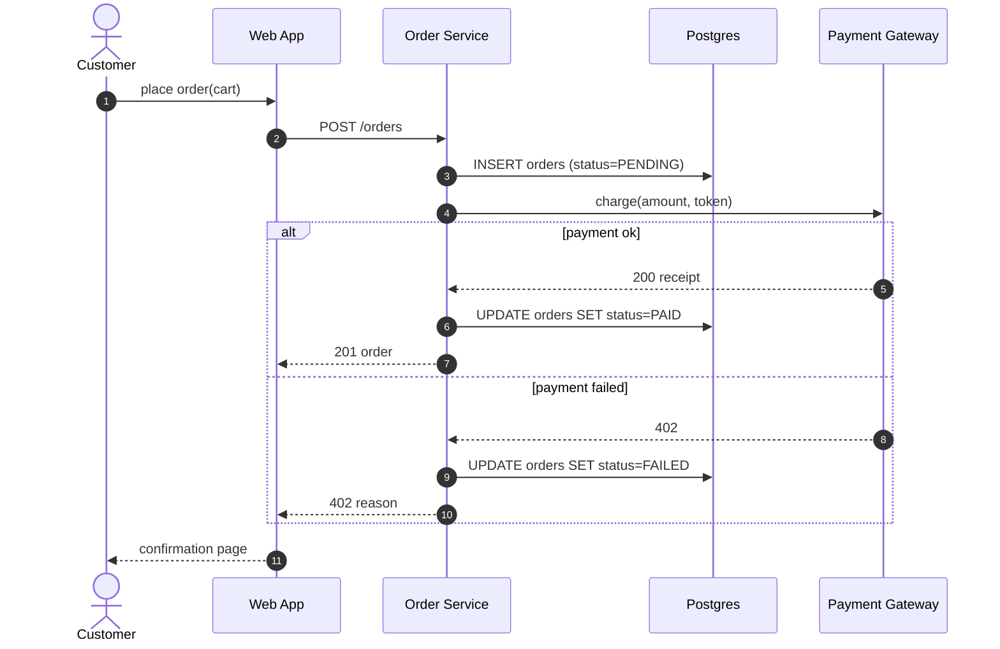

# UML Modeling Standard

Every model produced by this flow must be **read by engineers without
clarification calls**. This standard fixes notation, scope, and traceability
rules. It does **not** dictate tooling — Mermaid, PlantUML, draw.io, Lucid,
and Enterprise Architect all comply if the rules below are met.

## Diagram Set (and when each is required)

| Diagram          | KA5 Task    | Required when…                                                  | BABOK §       |
| ---------------- | ----------- | --------------------------------------------------------------- | ------------- |
| Use Case         | 5.1         | A persona-facing capability is in scope.                        | §10.47        |
| Activity / BPMN  | 5.1         | A multi-step process crosses ≥ 2 roles or systems.              | §10.35        |
| Sequence         | 5.1, 5.4    | Order of interactions across components/services matters.       | §10.42        |
| State            | 5.1         | An entity has a non-trivial lifecycle (≥ 3 states + transitions).| §10.44        |
| Class / Concept  | 5.1, 5.4    | Domain has named entities with attributes and relationships.    | §10.11, §10.15|
| Data Flow        | 5.1         | Data movement across boundaries is the principal concern.       | §10.13        |
| Component        | 5.4         | Deployment-relevant component boundaries are decided.           | (UML)         |

Pick the *minimum* set that answers the engineering question. A 12-diagram
package that nobody reads has negative value.

## Naming Conventions

- **Entities (classes, components, actors, states):** `PascalCase`, singular noun.
- **Messages, transitions, actions:** `verbPhraseInLowerCamel()`.
- **Use Cases:** verb-noun ("Submit Claim"), not noun-verb.
- **States:** adjective or past-participle ("Pending", "Settled"), not gerunds.
- **Actors:** map 1:1 to entries in `Context_Registry.md` Stakeholder section.
- **Files:** `KA5-<diagram_type>-<scope>.mmd` (Mermaid) or `.puml` (PlantUML) or `.drawio`.

## Required Annotations on Every Diagram

Every artifact carries a header block (in the file or as a caption):

```
Diagram-ID:    DGM-####
Type:          [UseCase | Sequence | State | Class | Activity | DFD | Component]
Scope:         <one sentence>
Author:        <name>     Date: <ISO date>     Version: <##>
Inputs:        Requirement-IDs covered: REQ-####, REQ-####
Assumptions:   <numbered list, each falsifiable>
Out-of-scope:  <numbered list>
```

Diagrams without this header are not accepted into engineering handoff.

## Notation Discipline

### Use Case
- Actors on the left, system boundary as a labeled rectangle, use cases inside.
- `<<include>>` and `<<extend>>` used **sparingly** — overuse is a tell that the level of abstraction is wrong.
- No "system" as an actor unless it is genuinely *external*.

### Sequence
- Time flows top to bottom; lifelines vertical.
- `sync` (filled arrowhead) vs `async` (open arrowhead) used correctly.
- Return arrows shown only when the return is non-obvious or carries data.
- `alt`, `opt`, `loop`, `par` fragments labeled with the guard condition.

### State
- Exactly one initial state (●), zero or more final states (◉).
- Every transition labeled with `trigger [guard] / effect`.
- Internal transitions used where state does not change (avoid spurious self-loops).

### Activity / BPMN
- One start node, ≥ 1 end node.
- Decisions (◇) are exhaustive and mutually exclusive — name every outgoing branch.
- Swim lanes used when responsibility crosses roles or systems.

### Class / Concept
- Multiplicities on every association (`1`, `0..1`, `*`, `1..*`).
- Composition (♦) vs aggregation (◇) used per UML, not interchangeably.
- Inheritance only when there is genuine substitutability (Liskov).

## Worked Example — Sequence Diagram in Mermaid



## Traceability Contract

Each diagram is logged in `working_session/Traceability_Matrix.md`:

```
Diagram-ID → covers Requirement-IDs → realizes Story-IDs → tested-by Test-IDs
```

A model that does not trace to ≥ 1 requirement is **either** missing a
requirement **or** is decoration. Both are blockers.

## Anti-Patterns

- **God diagrams** — 40+ elements on one page.
- **Inconsistent abstraction** — a UI button and a microservice cluster shown at the same level.
- **Hidden assumptions** in arrows ("magically calls X").
- **Untraceable diagrams** — no Requirement-ID linkage.
- **Tool-locked diagrams** that cannot be diffed in version control.
